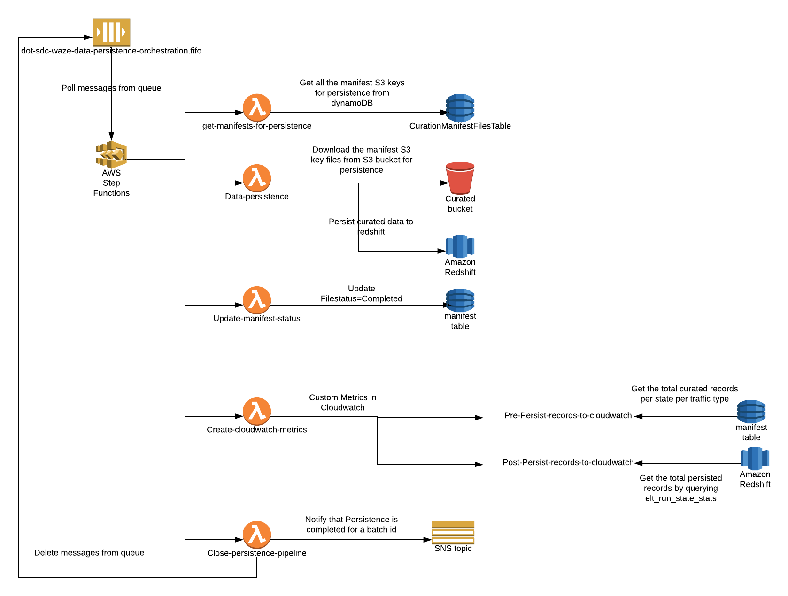

[](https://travis-ci.org/usdot-jpo-sdc-projects/sdc-dot-waze-data-persistence)
[](https://sonarcloud.io/dashboard?id=usdot-jpo-sdc-projects_sdc-dot-waze-data-persistence)
[](https://sonarcloud.io/dashboard?id=usdot-jpo-sdc-projects_sdc-dot-waze-data-persistence)

# sdc-dot-waze-data-persistence
This lambda function is responsible for persisting the data to Redshift.

<a name="toc"/>

## Table of Contents

[I. Release Notes](#release-notes)

[II. Overview](#overview)

[III. Design Diagram](#design-diagram)

[IV. Getting Started](#getting-started)

[V. Unit Tests](#unit-tests)

[VI. Support](#support)

---

<a name="release-notes"/>


## [I. Release Notes](ReleaseNotes.md)
TO BE UPDATED

<a name="overview"/>

## II. Overview
The primary function that this lambda function serves:
* **persist_records_to_redshift** - downloads the file from the S3 curated bucket to a temporary directory path and persists the file in the Redshift. Once the file is persisted in the redshift this file is deleted from the temporary location. 

<a name="design-diagram"/>

## III. Design Diagram



<a name="getting-started"/>

## IV. Getting Started

The following instructions describe the procedure to build and deploy the lambda.

### Prerequisites
* NA 

---
### ThirdParty library

*NA

### Licensed softwares

*NA

### Programming tool versions

*Python 3.6


---
### Build and Deploy the Lambda

#### Environment Variables
Below are the environment variable needed :- 

REDSHIFT_MASTER_USERNAME = {master_username_redshift}

REDSHIFT_JDBC_URL = {jdbc_url_to_connect_to_redshift}

REDSHIFT_ROLE_ARN = {role_arn_for_redshift}

REDSHIFT_MASTER_PASSWORD - {master_password_redshift}

FUNCTION_LOGIC  - {function_logic}

REDSHIFT_SQL_DIR  - {sql_directory_path_for_redshift}

CONFIG_BUCKET - {name_of_config_bucket}

SQL_KEY_PREFIX - {sql_file_key_prefix}

CURATED_BUCKET_NAME - {name_of_the_curated_bucket}

#### Build Process

**Step 1**: Setup virtual environment on your system by foloowing below link
https://docs.aws.amazon.com/lambda/latest/dg/with-s3-example-deployment-pkg.html#with-s3-example-deployment-pkg-python

**Step 2**: Create a script with below contents e.g(sdc-dot-waze-data-persistence.sh)
```#!/bin/sh

cd sdc-dot-waze-data-persistence
zipFileName="sdc-dot-waze-data-persistence.zip"

zip -r9 $zipFileName common/*
zip -r9 $zipFileName lambdas/*
zip -r9 $zipFileName redshift_sql/*
zip -r9 $zipFileName README.md
zip -r9 $zipFileName persist_curated_dataset_handler_main.py
zip -r9 $zipFileName root.py
```

**Step 3**: Change the permission of the script file

```
chmod u+x sdc-dot-waze-data-persistence.sh
```

**Step 4** Run the script file
./sdc-dot-waze-data-persistence.sh

**Step 5**: Upload the sdc-dot-waze-data-persistence.zip generated from Step 4 to a lambda function via aws console.

[Back to top](#toc)

---
<a name="unit-tests"/>

## V. Unit Tests

TO BE UPDATED

---
<a name="support"/>

## VI. Support

For any queries you can reach to support@securedatacommons.com
---
[Back to top](#toc)
